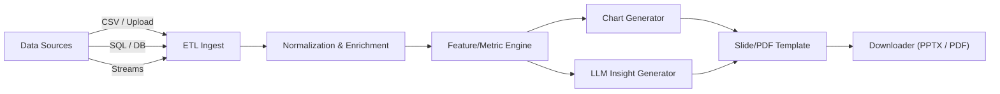

# H-001 — The Automated Insight Engine

**Track:** Data Engineering & Analytics

---

> Beautiful, executive-ready reports produced automatically from messy, multi-source AdTech telemetry.

---

## About

A production-ready pipeline that ingests heterogeneous AdTech data (CSV, SQL, streaming logs), transforms and enriches it, and automatically generates executive-grade PDF/PPTX reports with charts and LLM-written insights — zero manual screenshots, zero Excel surgery.

---

## Context & Problem

In AdTech we generate terabytes of telemetry every day: foot‑traffic logs, ad clickstreams, weather feeds, campaign metadata, and more. Account Managers still manually download CSVs, stitch visualizations, and screenshot results into weekly performance decks. This approach is slow, error‑prone, and unscalable for enterprise portfolios.

**The Vision:** an automated insight engine that: ingest → combine → analyze → narrate → export. The output is a downloadable, polished PDF or PowerPoint slide deck with key metrics and plain‑English takeaways.

---

## What this project delivers

* **End‑to‑end pipeline** for heterogeneous data sources (CSV, relational DBs, optionally streaming).
* **Data transformation & enrichment** using Pandas/Polars patterns and configurable ETL steps.
* **Automated visualization** generation (charts + small multiples) and layout templates for slides/PDFs.
* **Natural language analysis** produced by an LLM (configurable — GPT‑4o / Gemini or similar) that writes executive bullet points and summary paragraphs from computed metrics and anomalies.
* **One‑click export** to PDF and PPTX files, designed for direct client delivery.

---

## Repository snapshot

This repo contains a frontend (live collaboration UI) and a backend service that powers ingestion, analysis, and export. The project contains a `backend/` folder and a `live-collabs/` UI demo. (Repository and demo are being hosted in this project.)

---

## Architecture (high level)



Key components:

* **Ingest layer:** flexible connectors (CSV upload, JDBC/ODBC adapters, or flat file watchers).
* **Transform layer:** typed schema + validation + business rule enrichment (impressions → CTR, geo‑rollups, time bucketing).
* **Analysis & metric store:** compute daily/weekly KPIs, detect anomalies, compute deltas and significance testing where appropriate.
* **Narrative engine:** templated prompt that summarizes metrics and interprets anomalies via an LLM.
* **Renderer:** chart generation (Matplotlib/Plotly), layout engine (python‑pptx / reportlab) to output high‑fidelity PPTX/PDF.

---

## How this maps to the challenge

* **Ingests Data:** Accepts CSV and SQL; architecture supports adding connectors. ✅
* **Transforms Data:** Configurable transformation pipeline implemented in backend. ✅
* **Reports:** Produces downloadable PDF/PPTX without manual intervention. ✅
* **AI Integration:** LLM text generation for insights and executive summaries. ✅

---

## Tech stack

* **Backend:** Python 3.11+ — Pandas or Polars for heavy lifting, FastAPI for the service layer.
* **LLM integration:** OpenAI (GPT‑OSS 120B) via their SDKs / HTTP clients.
* **Rendering:** python‑pptx for PPTX, ReportLab / WeasyPrint for PDF exports.
* **Charts:** Matplotlib, Plotly and Seaborn (server‑side rendering to images inserted into slides).
* **Deployment:** Docker / docker-compose for local dev; Kubernetes + Helm for production.

---

## About the Datasets

The system is designed to handle rich, multi-source datasets commonly found in AdTech and marketing analytics. Below is an example of a representative dataset used for automated insight generation.

### Description
The Marketing Campaign Performance Dataset contains over **200,000 rows** of campaign telemetry collected across two years. It includes performance metrics, audience attributes, channel usage, spend, and engagement indicators that help analyze how effectively each campaign performs across different markets and segments.

### Columns
- **Company** — Fictional/anonymized brands running campaigns.  
- **Campaign_Type** — Email, social media, influencer, display, or search.  
- **Target_Audience** — Audience segments (e.g., women 25–34, men 18–24, all).  
- **Duration** — Campaign duration in days.  
- **Channels_Used** — Email, social, YouTube, websites, Google Ads.  
- **Conversion_Rate** — Percentage of impressions that led to desired actions.  
- **Acquisition_Cost** — Cost per acquired customer.  
- **ROI** — Profitability and return on investment.  
- **Location** — Cities such as New York, Los Angeles, Chicago, Houston, Miami.  
- **Language** — English, Spanish, French, German, Mandarin.  
- **Clicks** — Number of clicks generated.  
- **Impressions** — Total number of times the campaign was displayed.  
- **Engagement_Score** — Score from 1–10 indicating consumer engagement.  
- **Customer_Segment** — Tech enthusiasts, fashion lovers, wellness groups, foodies, etc.  
- **Date** — Timestamp of each campaign event to allow time-series analysis.

### Scope
This dataset enables detailed analysis of campaign performance, channel effectiveness, audience behavior, and ROI patterns. It serves as a foundation for automated KPI extraction, trend detection, narrative generation, and visual reporting.

### Concurrent Datasets
The engine also supports **multiple datasets uploaded together**—such as campaign metrics, foot-traffic logs, weather data, or pricing feeds. By combining concurrent sources, the system can generate richer insights, cross-dataset correlations, and more advanced PDF/PPTX visualizations in a single export.

---

## Configuration

Edit `backend/.env` (or the environment variables used by your runtime).

---

## How it works — pipeline details

### 1. Ingest

* Bulk CSV upload: users can upload raw CSVs via the UI or POST to `/api/ingest/upload`.
* SQL ingestion: provide a JDBC/DB URL and query to snapshot campaign tables.
* Streaming (optional): connector pattern to plug Kafka or Pulsar consumers.

### 2. Normalize & Clean

* Schema discovery runs on first ingest: types are inferred, sample rows checked, and a lightweight schema stored.
* Null handling, deduplication, timezone normalization, and mapping of campaign IDs/aliases happen here.

### 3. Compute & Enrich

* Compute derived fields (CTR, CPC, spend per conversion).
* Aggregate at required dimensions (daily/weekly, region, device).
* Run anomaly detection (z‑score/differencing or simple EWMA) to surface candidates for explanation.

### 4. Narrative

* Metric snapshot (top KPIs + week‑over‑week deltas) is assembled into a compact JSON.
* A prompt template wraps this JSON with context and instructions for the LLM (voice: executive; length: 3–6 bullets + 1 paragraph).
* LLM returns bullets and a headline. The pipeline runs minimal safety checks and length constraints before embedding into the slide.

### 5. Render

* Charts are rendered server‑side, exported as PNG/SVG, and embedded into PPTX slide templates.
* LLM bullets are placed into slide text boxes with pre‑defined fonts and layouts.
* Final artifact is exported to S3 and a signed URL is provided to the user.

---

## API endpoints

### Trigger a report

```http
POST /api/report/run
Content-Type: application/json

{ "data_source": "upload", "dataset_id": "abc123", "report_type": "weekly", "template": "client_basic" }
```

**Response**

```json
{ "report_id": "rpt_2025_11_30_123", "download_url": "https://.../rpt_2025_11_30_123.pptx" }
```

---

## Design decisions & rationale

* **Use server‑side rendering of images** to ensure deterministic PDFs/PPTX across clients.
* **Keep narrative generation outside renderers**: LLMs produce text only; the renderer is responsible for layout and accessibility.
* **Template driven**: allows marketing/account teams to swap slide templates without touching code.
* **Separation of compute and narrative**: reproducible metrics (with provenance) are passed to the LLM so that text is traceable to computed values.

---

## Performance & scaling notes

* For large datasets, switch to Polars and chunked processing with Parquet slices.
* Use async workers and a task queue (Celery/RQ) for long‑running report generation.
* Cache intermediate aggregates in Redis for repeat requests.

---

## Testing & validation

* Unit tests for ETL transformations and metric correctness live under `backend/tests/`.
* Integration tests simulate a full run: ingest → compute → LLM call (mocked) → render.
* Use synthetic datasets that mirror production scale (traffic logs + clickstream + weather joins).

---
